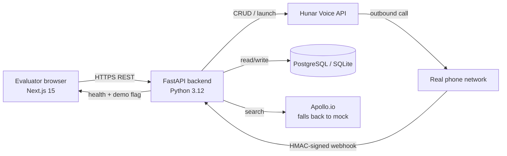

# Hunar AI — Hiring Assistant

AI-powered voice hiring platform built with FastAPI + Next.js, integrating Hunar Voice Agents API.

> **Demo mode is the default.** The first time you open the deployed app you'll see a populated dashboard — 4 agents, 3 campaigns, 128 candidates, 94 completed call results. A persistent **"Demo Environment"** badge in the sidebar makes the mode visible at all times. Re-seed any time from `/settings` (requires `ADMIN_TOKEN` on the backend). See [Demo / Live mode](#demo--live-mode).
>
> **Repository:** https://github.com/jyothir-369/-hunar-assignment

## Problems Solved

1. **AI Hiring Assistant** — Create voice agents, manage campaigns, place bulk calls to candidates, capture structured results.
2. **People Search & Reachout** — Search candidates via Apollo.io, trigger voice outreach, view responses in a dashboard.
3. **Attendance Without Smartphones** — Multi-channel attendance system using voice, IVR, SMS, and biometric. See `PROBLEM3.md` for the full design brief, and the in-app `/attendance` page for a visual architecture walkthrough.

## Tech Stack

**Backend:** Python 3.12+, FastAPI, SQLAlchemy, Pydantic v2, APScheduler
**Frontend:** Next.js 15 (TypeScript), shadcn/ui, Tailwind CSS
**Database:** PostgreSQL (production) / SQLite (local dev)
**External APIs:** Hunar Voice Agents, Apollo.io

## Architecture



Data flow: the recruiter creates an agent, attaches it to a campaign, uploads candidates, hits Launch → FastAPI calls Hunar → Hunar dials the candidates → on completion Hunar posts a signed webhook back → FastAPI updates the local DB → the dashboard reflects the new structured result on next render.

## Project Structure

```
hunar-assignment/
├── backend/                  # FastAPI Python backend
│   ├── src/
│   │   ├── main.py
│   │   ├── config.py
│   │   ├── database.py
│   │   ├── models/           # Agent, Campaign, Candidate, CallEvent
│   │   ├── schemas/          # Pydantic schemas
│   │   ├── routers/          # agents, campaigns, candidates, webhooks
│   │   ├── services/         # hunar_client, apollo_client
│   │   └── utils/            # security (HMAC validation)
│   ├── scripts/              # seed_demo_data.py (no live API) + seed_test_data.py (legacy, requires HUNAR_API_KEY)
│   ├── requirements.txt
│   └── .env.example
├── frontend/                 # Next.js 15 (TypeScript)
├── PROBLEM3.md               # Problem 3 — multi-channel attendance architecture
└── README.md
```

## Local Setup

### Backend
```bash
cd backend
pip install -r requirements.txt
cp .env.example .env  # Add your HUNAR_API_KEY
uvicorn src.main:app --reload --port 8000
```

API docs: http://127.0.0.1:8000/docs

### Frontend
```bash
cd frontend
npm install
# Create .env.local with the API URL (defaults to http://127.0.0.1:8000 if unset)
echo 'NEXT_PUBLIC_API_URL=http://127.0.0.1:8000' > .env.local
npm run dev
```

UI: http://localhost:3000

## Environment Variables

| Variable | Required | Description |
|----------|----------|-------------|
| HUNAR_API_KEY | Yes | From Hunar dashboard |
| APOLLO_API_KEY | For Problem 2 | Apollo.io API key |
| DATABASE_URL | No | Defaults to SQLite |
| HUNAR_WEBHOOK_SECRET | For prod | HMAC secret for webhook validation |
| FRONTEND_URL | For CORS | Default: http://localhost:3000 |
| HUNAR_WEBHOOK_URL | For prod | Public HTTPS URL where Hunar delivers webhooks |
| ADMIN_TOKEN | For demo re-seed | Shared secret for `POST /api/admin/seed-demo`. If unset, the endpoint returns 503. |

See `.env.example` for the full template.

## API Endpoints

| Method | Endpoint | Description |
|--------|----------|-------------|
| GET | /health | Health check |
| GET | /api/agents/ | List agents |
| POST | /api/agents/ | Create agent (syncs to Hunar) |
| GET | /api/agents/{id} | Get agent details |
| PUT | /api/agents/{id} | Update agent |
| DELETE | /api/agents/{id} | Delete agent |
| GET | /api/campaigns/ | List campaigns |
| POST | /api/campaigns/ | Create campaign |
| GET | /api/campaigns/{id} | Get campaign with stats |
| POST | /api/campaigns/{id}/launch | Launch campaign (triggers Hunar calls) |
| GET | /api/candidates/ | List candidates |
| POST | /api/candidates/ | Add candidate |
| POST | /api/candidates/bulk | Bulk add candidates |
| POST | /api/candidates/upload-csv | Upload CSV |
| POST | /api/people/search | Apollo.io people search (falls back to mock data) |
| GET | /api/calls/{call_id} | Proxy a single Hunar call record |
| GET | /api/calls/{call_id}/result | Proxy the structured call result |
| GET | /api/settings/ | Runtime configuration & integration health |
| POST | /webhooks/hunar | Hunar webhook receiver |
| POST | /api/admin/seed-demo | Idempotent demo re-seed. Requires `X-Admin-Token` header. |

## Demo / Live mode

The app ships with two evaluation paths so a reviewer can click through a fully populated UI even without live API keys:

- **Demo mode** — Run `python backend/scripts/seed_demo_data.py` to populate 4 agents, 3 campaigns, 128 candidates, and 94 synthetic completed-call results (~31 qualified, ~33–47 interested depending on the run's random sampling) — no live Hunar or Apollo API call required. The script is idempotent (skips work if a `Demo Recruiter Agent` already exists) and writes directly to the local DB.
- **Live mode** — With `HUNAR_API_KEY` and `APOLLO_API_KEY` set, every action reaches the real Hunar Voice API and Apollo.io. Webhook callbacks update candidates in real time. The legacy `backend/scripts/seed_test_data.py` exercises the real `/api/agents/`, `/api/campaigns/`, `/api/candidates/bulk`, and `/api/campaigns/{id}/launch` endpoints end-to-end (requires a valid `HUNAR_API_KEY`).

Apollo's `/api/people/search` endpoint also falls back to a curated mock dataset when no `APOLLO_API_KEY` is configured, so People Search always has results to display. The dashboard surfaces a "Demo Environment" badge when the demo seed has been run.

## Security

- API keys stored only in `.env` (git-ignored)
- Webhook signature validation via HMAC-SHA256
- CORS restricted to known frontend origins (Vercel preview regex + explicit localhost)
- `/api/settings/` never returns secret values — only presence + masked prefix; each field is independently try/except'd so one failure can't 500 the whole endpoint
- `/api/admin/*` endpoints require an `X-Admin-Token` header and return 503 (not 401) when the server-side `ADMIN_TOKEN` is unset — no backdoor, no default token
- No sensitive data in source code or commits

## License

MIT
